# 🧠 DSAT Score Improvement Analysis Tool

## 📘 Overview

This Python-based analysis tool was developed as part of the HighScores.ai assignment to evaluate **Digital SAT (DSAT)** performance. It enables deep insight into student attempts, supports what-if scenarios for score improvement, and provides visualizations for both educators and learners. **MongoDB** is used for data storage and retrieval.

### ✨ Key Features

- 📥 Imports student attempt data (`user_attempt_v2.json`, `user_attempt_v3.json`) and scoring maps (`scoring_DSAT_v2.json`) into MongoDB.
- 📊 Analyzes performance by subject and module (Module 1: Static, Module 2: Adaptive).
- 🛠️ Identifies weak topics and slow-response questions (>60 seconds).
- 🔁 Runs what-if simulations to estimate score improvement by correcting additional Module 1 questions.
- 📈 Generates:
  - 🖼️ A Matplotlib bar chart: `what_if_analysis.png`
  - 🧩 Chart.js configuration: `chartjs_config.json`
- 🎯 Tunes Module 1 threshold to determine Module 2 difficulty.

---

## 🗂️ Information Architecture Diagram

The diagram below illustrates the flow of data and components in the **DSAT Score Improvement Analysis Tool**. It helps developers and contributors quickly understand how input files are processed, how data is stored in MongoDB, and how outputs like performance metrics and visualizations are generated.

### 🧩 Key Components:

- 📂 **Input Files**: Raw data in JSON and DOCX formats, including student attempts, scoring criteria, and what-if logic.
- 🗃️ **MongoDB**: Structured storage for question metadata and student performance data.
- 🐍 **`analysis.py`**: Core script that ingests data, performs performance analysis, simulates score improvements, and tunes thresholds.
- 📤 **Outputs**:
  - 📊 `what_if_analysis.png`: Matplotlib bar chart comparing actual vs. simulated scores.
  - 🌐 `chartjs_config.json`: JSON config for rendering charts using Chart.js.
  - 🧾 Console logs for debugging and metric summaries.

This modular architecture supports scalable analysis and easy integration with frontend dashboards or additional analytics pipelines.

```mermaid
graph TD
  A[📂 Input Files]
  A1[📄 scoring_DSAT_v2.json]
  A2[📄 user_attempt_v2.json / v3.json]
  A3[📄 What-if-analysis.docx]

  B[🗃️ MongoDB]
  B1[📦 sat_scoring Collection]
  B2[📦 student_results Collection]

  C[🐍 analysis.py]
  C1[📊 Performance Analysis]
  C2[🔁 What-if Simulation]
  C3[🎯 Threshold Tuning]

  D[📤 Outputs]
  D1[🖼️ what_if_analysis.png]
  D2[🌐 chartjs_config.json]
  D3[🧾 Console Logs]

  %% File Flow
  A1 --> B1
  A2 --> B2
  A3 --> C

  B1 --> C
  B2 --> C

  C --> C1
  C --> C2
  C --> C3

  C1 --> D3
  C2 --> D1
  C2 --> D2
  C3 --> D3
```

## 🔧 Technologies Used

- 🐍 **Python 3.8+** – Core scripting language for data processing and analysis  
- 🗄️ **MongoDB 8.0.11** – NoSQL database for storing scoring maps and student attempts  
- 📊 **Matplotlib** – Generates static visualizations (e.g., what-if score comparisons)  
- 🌐 **Chart.js** – Produces dynamic, web-friendly charts from analysis output  
- 📄 **python-docx** – Parses `.docx` files containing analysis logic and observations  
